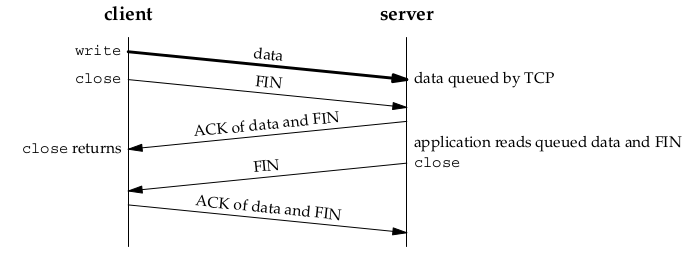
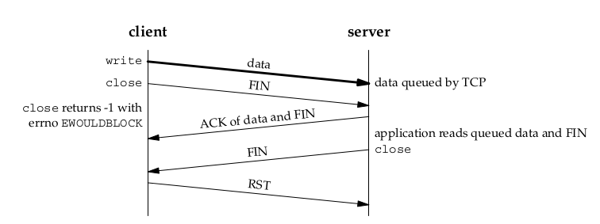

# introduction
默认条件之下socket是blocking的, 这就意味着如果操纵socket进行读或者写的时候如果不满足条件的话是直接送去sleep的.但是如果是nonblocking的话, 如果不满足可读或者可写的条件的话是直接返回一个`EWOULDBLOCK`的错误.
最直接的应用是之前我们已经介绍过的`str_cli`函数, 该函数通过管理两个buffer来实现nonblocking 的IO


具体思想在于使用`select`函数来对这两个buffer进行管理, 该函数要进行的任务为从stdin中读取数据发送到server, 再从server读取echo回来的数据输出到stdout中. 
# Using fork
上面的方式虽然对效率的提升最大, 但是也最为复杂.另外一种比较简单的方式是使用fork

parent读入stdin并利用sockfd发送到server, child从sockfd读入server echo回来的数据并通过stdout输出.这种情况下parent和child共享一个sockfd, 也就意味着只能拥有一个socket, 一个send buffer和一个receive buffer.这种共享sockfd的设计对于结束TCP连接的时候有要求.
这个时候因为parent和child共享一个socket, 因此如果想要关闭连接的话, 必须使用`shutdown`而不能使用`close`, 因为close只会把descriptor的引用数量减一, 只有当引用数量为0的时候才会真正关闭这个descriptor, 因此在这里应该使用`shutdown`函数.但是实际上close可以设置option来控制其返回行为.像TCP或者是SCTP这样connection-oriented的协议可以使用, UDP不行.`SO_LINGER`通过使用结构体`linger{}`来自定义close的行为.
```C
struct linger{
    int l_onoff;
    int l_linger;
};
```
- 如果`l_onoff`为0, 那么不管`l_linger`的值是多少都和默认状态下的close是一样的, 立即返回.如果此时send buffer非空的话, 并且descriptor的reference减少到0, 发送FIN和send buffer中剩下的数据, 把receive buffer中的数据丢掉.
- 如果`l_onoff`非0, 但是`l_linger`的值为0, 那么直接丢掉socket send buffer和receive buffer中剩余的数据发送给peer一个RST, 注意这样的情况之下是不会发生经典的four packet connection termination sequence, 执行了active close的这一方直接进入close_state, 跳过time_wait.但是这样的话在2MSL时间内如果建立了新的连接有可能会出现旧连接的packet被新连接接受这样的情况.
- 如果`l_onoff`非0, 但是`l_linger`的值也非0, 那么这个时候就存在两种情况, 第一种设置的时间timeout之前, client这边就收到了send buffer剩余数据和FIN的ACK, 那么close就正常返回.

另外一种情况的话则是timeout设置的过小了, 这段时间内还没有收到server的ACK, 那么close返回-1带着error类型`EWOULDBLOCK`.



# Nonblocking connect
回想一下TCP three handshakes 的过程, 首先是client发送SYN给server(调用connect), server收到之后发回ACK和它自己的SYN, client收到之后(connect返回)发送ACK给server, server此时的accept可以返回.
也就是说从调用connect到connect返回至少要经过一个RTT, 现在使用nonblocking的方式让其立刻返回, 并设置error为`EINPROGRESS`, 返回之后继续完成three-way handshake, 我们之后可以使用`select`来看连接是否成功.使用这种nonblocking的方式来进行连接的话我们同时可以创建多个TCP连接, 并且我们是使用`select`来看连接是否成功, 因此我们可以自主定义这个timeout, 这比原来的75秒或者是几分钟要短得多了.
如果connect在连接的过程中被打断了, 那么我们应该采取的措施和使用nonblocking connect的方式应该是一样的, 也就是使用`select`函数来等待结果, 连接成功(socket writable), 或者是连接失败(socket readable and writable)