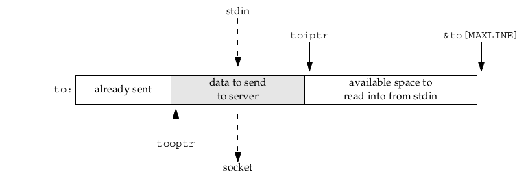
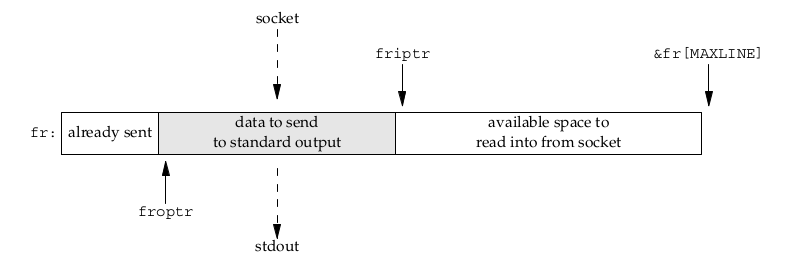
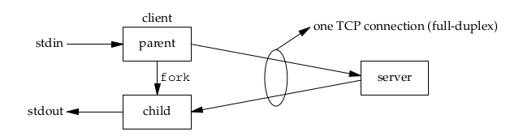

# introduction
默认条件之下socket是blocking的, 这就意味着如果操纵socket进行读或者写的时候如果不满足条件的话是直接送去sleep的.但是如果是nonblocking的话, 如果不满足可读或者可写的条件的话是直接返回一个`EWOULDBLOCK`的错误.
最直接的应用是之前我们已经介绍过的`str_cli`函数, 该函数通过管理两个buffer来实现nonblocking 的IO

具体思想在于使用`select`函数来对这两个buffer进行管理, 该函数要进行的任务为从stdin中读取数据发送到server, 再从server读取echo回来的数据输出到stdout中. 
# Using fork
上面的方式虽然对效率的提升最大, 但是也最为复杂.另外一种比较简单的方式是使用fork

parent读入stdin并利用sockfd发送到server, child从sockfd读入server echo回来的数据并通过stdout输出.这种情况下parent和child共享一个sockfd, 也就意味着只能拥有一个socket, 一个send buffer和一个receive buffer.这种共享sockfd的设计对于结束TCP连接的时候有要求.
# Nonblocking connect
回想一下TCP three handshakes 的过程, 首先是client发送SYN给server(调用connect), server收到之后发回ACK和它自己的SYN, client收到之后(connect返回)发送ACK给server, server此时的accept可以返回.
也就是说从调用connect到connect返回至少要经过一个RTT, 现在使用nonblocking的方式让其立刻返回, 并设置error为`EINPROGRESS`, 返回之后继续完成three-way handshake, 我们之后可以使用`select`来看连接是否成功.使用这种nonblocking的方式来进行连接的话我们同时可以创建多个TCP连接, 并且我们是使用`select`来看连接是否成功, 因此我们可以自主定义这个timeout, 这比原来的75秒或者是几分钟要短得多了.
如果connect在连接的过程中被打断了, 那么我们应该采取的措施和使用nonblocking connect的方式应该是一样的, 也就是使用`select`函数来等待结果, 连接成功(socket writable), 或者是连接失败(socket readable and writable)