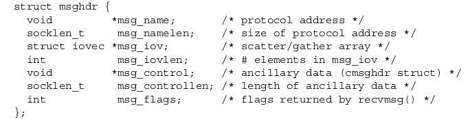
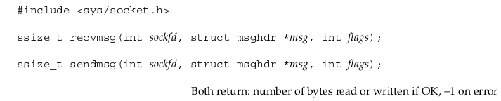
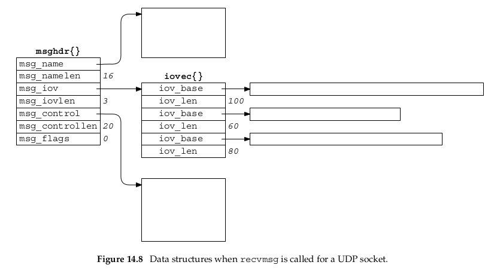
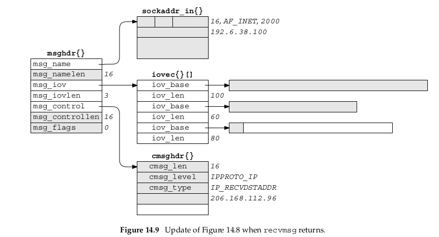
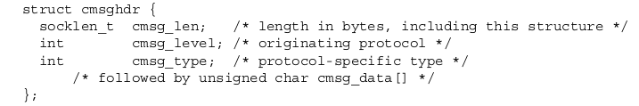
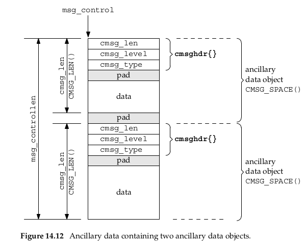
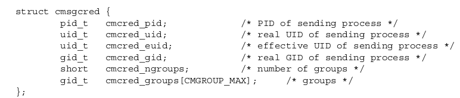

# Introduction
Unix domain Protocol是用来进行同一个host上的进程之间的通讯的，这很像Unix提供的pipe函数，这种也是IPC的一种方式，事实上按照分类也可以分为stream socket(像TCP)或者是datagram socket(像UDP)一样.网络通讯通过IP地址和port号来确定host,那么进程之间就利用`pathname`来确定.
# Socket Address Structure
类似于`sockaddr_in`,这种Unix domain也存在对应的储存地址的结构体:

其中`sun_familily`占用2bytes,指定的类型应该为`AF_LOCAL`.
在使用Unix domain socket的时候,与network socket对比存在以下的几点不同以及限制:
- 文件的permission(rwx,用三个八进制数来表示user, group, 和other的权限)由umask值和0777确定(0777 - umask).
- `pathname`应是一个绝对路径不能是相对路径.
- 在`connect`函数中指定的`pathname`必须和已经bind到Unix domain socket是同样的类型(stream或者是datagram).
- 对其使用`connect`函数的话和使用`open`函数write only的情况相同.
- 如果调用`connect`的时候listening方的queue满了,这个时候会直接返回赢得`ECONNREFUSED`,这就和TCP不一样了,TCP在遇到这种情况的时候,listening这一方会忽略SYNbit,这时候发送方会多尝试几次发送SYN
- 和UDP不一样的地方在于如果使用一个unbound的一个UDP socket发送数据的话kernel不会自动给它bind一个`pathname`(UDP会在发送的时候给它分配一个端口),这也就意味着不bind就不是full-duplex,receiver无法回复消息.也就是说无论是TCP还是UDP,如果不bind的话,在`connect`函数中kernel是不会帮你bind的.
# passing out-of-band data
像`cmghdr{}`和`cmsgcred{}`这样的结构体是属于out-of-band data, 什么是out-of-band data呢?他和in-bind data有什么区别呢?
在两个host进行交流的时候有时候会希望存在一种方式告知对方目前连接的情况, 那么在这种情况下不能直接发送信息过去, 因为这样对方无法分辨是正常的数据还是告知条件的数据. 因此常用的实现方式是用header来进行标识, TCP中就存在一个`urgent pointer`将特定的数据标识为out-of-band
## passing descriptors
现在考虑以下问题,如何将开放的descriptor从一个进程传到另外一个进程,比较容易想到的思路是通过fork来实现,因为child process会拥有所有parent process的descriptor,另外一种方式是通过exec类函数,这类函数可以将替换进程的image的时候是保持所有descriptor开放的.那么如何在一个进程中让另外一个进程的某个descriptor开放呢,这个时候就需要使用到Unix domain protocol了.
简而言之是通过进程之间通讯的方式来完成在一个进程中要求另外一个进程的某个descriptor开放,具体的步骤如下:
- 首先创造一个Unix domain socket,如果进程之间是无关的(例如不是父子关系),那么具体步骤就和我们之前叙述的相似,server和client bind某个pathname之后connect来进行通讯
- 之后就可以创建新的descriptor(使用open, pipe, socket, accept这种函数),也可以看出我们要求的是在进程之间传递descriptor,而不是仅仅file descriptor.
- sending process通过一个`msghdr`结构体来传递希望接受者打开的descriptor, 在使用`sendmsg`函数之后我们可以称这个descriptor进入了in flight状态,这时候哪怕刚刚调用完`sendmsg`函数进程就把这个descriptor关了(当然是在接受者调用`recvmsg`之前),这个descriptor是始终开放的.
---
在进行下一步详细介绍如何pass descriptor之前,首先来补充一下关于ancillary data的知识.那么就不得不提到另外一个和它一起关系密切的结构体`msghdr{}`

这里也顺便补充一下`sendmsg`和`recvmsg`的知识, 这两个函数可以进行scatter read(读出来的数据可以放到多个buffer中)和gather write(可以让多个buffer中的数据写到一个输出之中).

注意这个地方传递的是`msghdr`结构体指针, 也就意味着这两个函数可以对结构体中的值进行修改,但是其中的`msg_flags`成员存在差异, 只有`recvmsg`能够对其进行修改, 而`sendmsg`不能, 换句话说就这一个成员而言, 前者才是真正意义上的value-result成员, 后者尽管可以修改但是函数的设计上选择了忽略这个成员.
假设现在一个UDP socket在调用`recvmsg`之前是这样的

那么调用之后就是这样的

可以看到`recvmsg`对结构体进行了填充, 具体细节不进行展开.

---
下面正式开始介绍ancillary data.这个数据又被称为是control information.在`msghdr{}`结构体中可以看到存在`msg_control`和`msg_controllen`这两个数据成员.
其中前者是一个结构体指针指向`cmsghdr`, 其数据成员有:

`msg_control`指向的一系列`cmsghdr`结构体以及数据部分之间是可能会存在pad的, 目的是为了让它们对齐, 使得kernel能够更有效率的访问其中的结构体以及数据.

那么具体来说应该怎么在不同的进程之间进行descriptor的传递呢?这里给出一个例子,思考一下`cat`是如何工作的
- 在`cat`程序中设定`socketpair`, 之后进行fork出一个child 
- child去执行对应的打开文件的指令, 并将打开文件的fd传递给parent
- parent读取接受到的fd, 再从fd中读取文件内容最终打印出来
在上述过程中child与parent之间传递fd就是通过`msghdr{}`的结构体来进行的.
## receive sender credentials
在client和server进行交流的时候, server有必要知道client的权限从而知道哪些request是可以被满足的而有些则不能.

具体结构如图所示