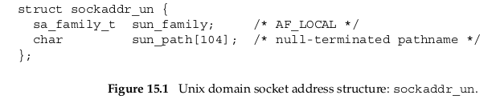

# Introduction
Unix domain Protocol是用来进行同一个host上的进程之间的通讯的，这很像Unix提供的pipe函数，这种也是IPC的一种方式，事实上按照分类也可以分为stream socket(像TCP)或者是datagram socket(像UDP)一样.网络通讯通过IP地址和port号来确定host,那么进程之间就利用`pathname`来确定.
# Socket Address Structure
类似于`sockaddr_in`,这种Unix domain也存在对应的储存地址的结构体:

其中`sun_familily`占用2bytes,指定的类型应该为`AF_LOCAL`.
在使用Unix domain socket的时候,与network socket对比存在以下的几点不同以及限制:
- 文件的permission(rwx,用三个八进制数来表示user, group, 和other的权限)由umask值和0777确定(0777 - umask).
- `pathname`应是一个绝对路径不能是相对路径.
- 在`connect`函数中指定的`pathname`必须和已经bind到Unix domain socket是同样的类型(stream或者是datagram).
- 对其使用`connect`函数的话和使用`open`函数write only的情况相同.
- 如果调用`connect`的时候listening方的queue满了,这个时候会直接返回赢得`ECONNREFUSED`,这就和TCP不一样了,TCP在遇到这种情况的时候,listening这一方会忽略SYNbit,这时候发送方会多尝试几次发送SYN
- 和UDP不一样的地方在于如果使用一个unbound的一个UDP socket发送数据的话kernel不会自动给它bind一个`pathname`(UDP会在发送的时候给它分配一个端口),这也就意味着不bind就不是full-duplex,receiver无法回复消息.也就是说无论是TCP还是UDP,如果不bind的话,在`connect`函数中kernel是不会帮你bind的
  